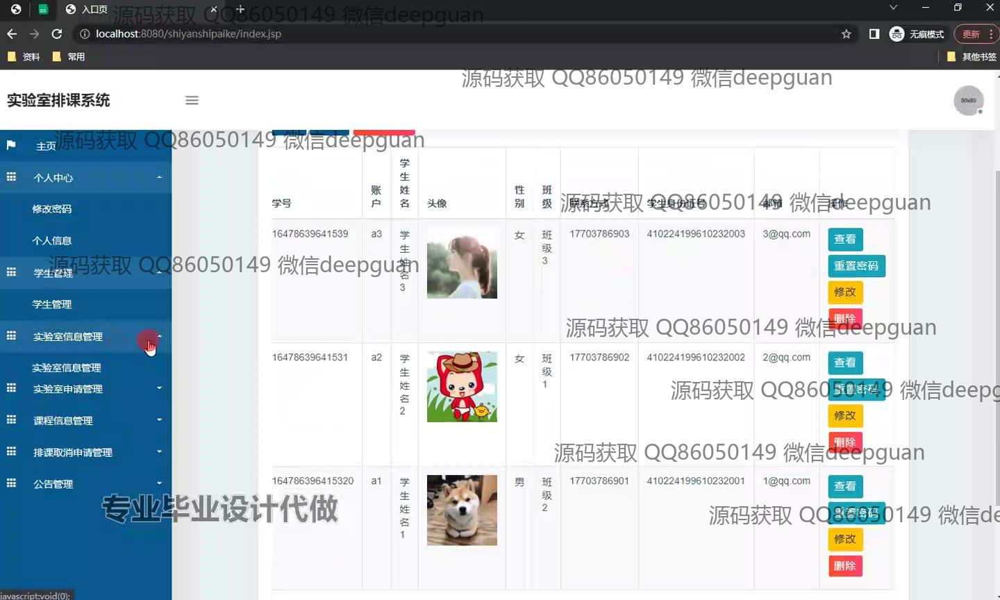
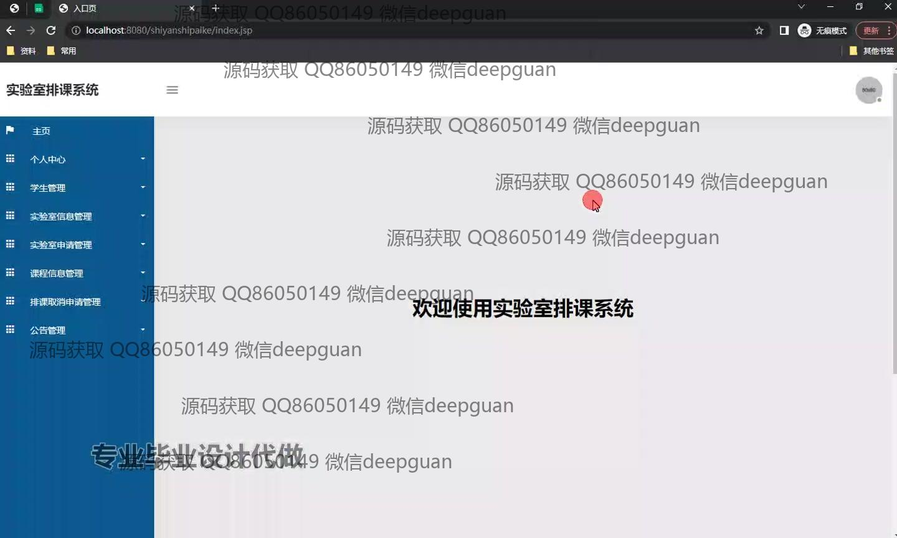
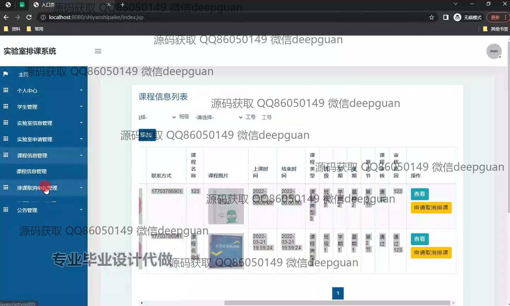

<h1 align="center">实验室排课系统+jsp</h1>

## 简介
实验室排课系统：角色分为管理员、教师、学生；提供课程信息管理、实验室资源分配、实验室申请审核、排课取消申请管理、用户信息维护等功能。    --计算机毕业设计源码；毕设源码；java毕业设计源码

## 联系方式

<h3 align="center">获取完整代码与数据库文件 + 微信：deepguan QQ: 86050149 QQ群: 783742310</h3>

<h3 align="center">可帮忙远程部署 包运行成功！提供远程部署、修改代码、设计文档指导、代码讲解等服务！</h3>

## 功能介绍（完整见运行截图）
管理员：管理员可以访问个人中心、管理员管理、教师管理、学生管理、实验室信息管理、课程信息管理、实验室申请管理、排课取消申请管理和公告管理等多个功能模块。系统为管理员提供实验室资源的分配及使用计划的管理，课程的录入、修改及资源调配，学生信息管理及实验室申请的查看、审核、删除等功能。此外，管理员可以在课程信息列表查看和处理课程，以及管理用户身份权限。  
教师：教师可通过登录页面选择身份进入系统，与学生和管理员一样访问个人中心。教师可以查看、申请、审核及管理实验室信息，查看课程信息并进行排课维护，申请实验室资源，并查看和响应实验室申请的审核结果。系统为教师提供了提交实验室及课程申请的接口，也可通过导航菜单进行排课取消申请管理。  
学生：学生通过选择身份可进行登录，系统功能导航栏允许访问个人中心、实验室信息管理等模块。学生可以查看课程信息，申请使用实验室，课程安排及取消申请查看，并参与实验室资源调配。学生个人数据可以灵活管理，通过课程信息管理进行参与的课程查看，同时访问学期的课程表安排。  
用户：用户在系统中主要实现身份认证及权限区分，通过选择管理员、教师或学生的角色进入对应的功能模块。用户可以通过系统的课程信息管理浏览课程资料，查看实验室使用情况，并通过表单填写信息进行实验室和课程相关申请，使用互动操作如查看、修改、删除来维护个人信息和管理实验室调配工作。

## 运行截图

本代码来源于网络,仅供学习参考使用!

